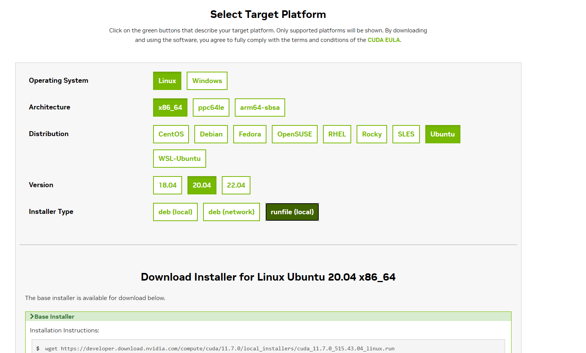
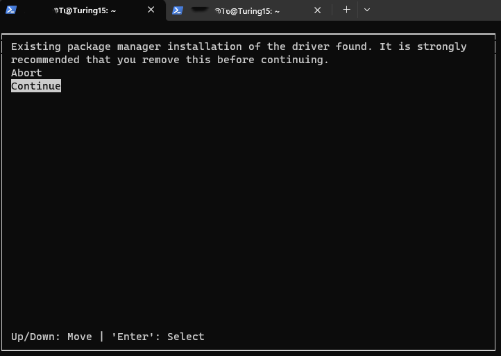
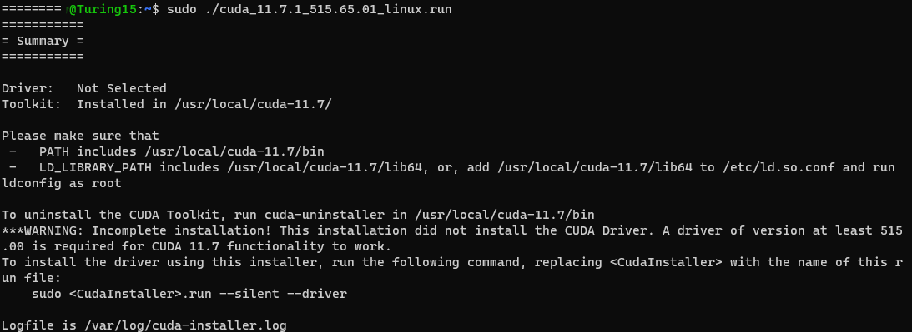

# 从入门到跑路：服务器使用指南

本教程所有操作请在**你自己的**拥有管理员权限的账户和home目录下进行，**请勿使用ubuntu，root账户**。

目前本教程包括CUDA和CONDA的安装示例。-2023/6/9

## 1.如何正确安装CUDA？(以11.7为例)

### #1 下载.runfile

直接必应搜索你想下载的版本是最快的（例：“CUDA 11.7"，第一个就是）

***注意系统版本号！！！***

运行网页中给出的wget命令即可将安装文件下载到服务器本地。



### #2 运行.runfile

```bash
#此步修改文件权限，有时可忽略，为了保险就加上了。
#版本号与截图中略有差异，以下载版本为准（输入./cuda按tab补全）
chmod 777 cuda_11.7.1_515.65.01_linux.run 
sudo ./cuda_11.7.1_515.65.01_linux.run
```

安装过程中有几处建议勾选/去勾选，具体请参考图片




**这一步选no，否则会覆盖系统的CUDA！**



之后运行下列代码

```bash
echo -e "PATH=\"/usr/local/cuda-11.7/bin:\$PATH\"\nLD_LIBRARY_PATH=\"/usr/local/cuda-11.7/lib64:\$LD_LIBRARY_PATH\"" >> ~/.bashrc
# 更新bashrc
source ~/.bashrc 
nvcc -V 
# 应当会显示11.7，此时你的账户使用的CUDA版本就是这个了。
```

## 2.如何安装conda？(以miniconda为例)

远程服务器一般不需要conda的完整版本，按需下载和更新，使用miniconda即可。

```bash
wget https://mirrors.tuna.tsinghua.edu.cn/anaconda/miniconda/Miniconda3-py39_23.3.1-0-Linux-x86_64.sh
# 其他版本可以在https://mirrors.tuna.tsinghua.edu.cn/anaconda/miniconda/查找。
chmod 777 ./Miniconda3-py39_23.3.1-0-Linux-x86_64.sh
bash ./Miniconda3-py39_23.3.1-0-Linux-x86_64.sh
source ~/.bashrc
# 接下来新建你需要的虚拟环境。记得指定环境名称NAME和python版本
conda create -n NAME python=3.8 -y && conda activate NAME
```

此时你的终端左侧应该就会出现标识当前环境的*(NAME)*了。